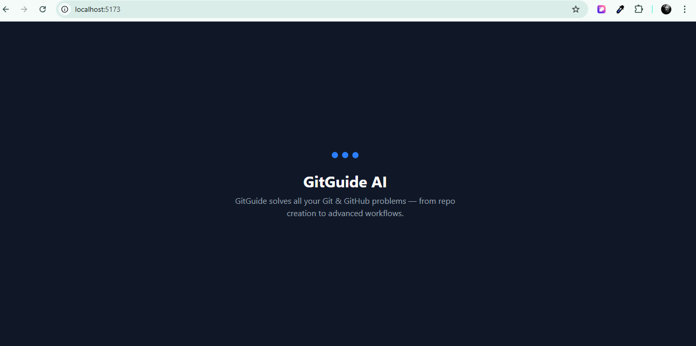
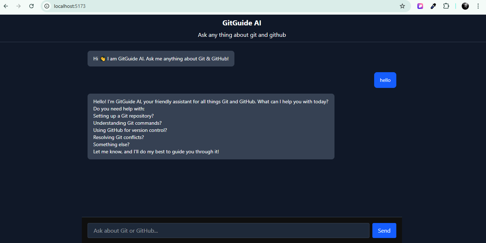
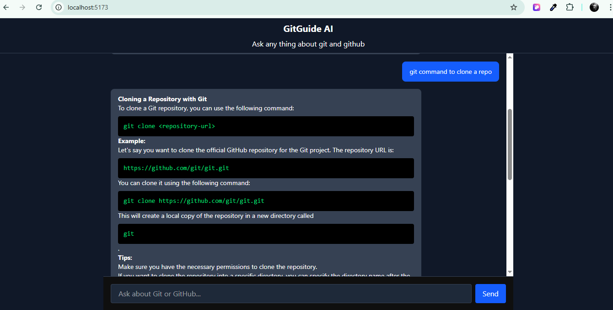

# 🤖 GitGuide AI

GitGuide AI is a full-stack AI-powered assistant designed to help developers with **Git & GitHub commands, workflows, and best practices**.

---

## 🖼️ Preview

### ⏳ Starter Loader

### 💬 Chat Interface

---

## 🚀 Features

- 💬 AI Chat Assistant for Git & GitHub
- 🧠 Powered by LLMs (Groq / HuggingFace support)
- ⚡ FastAPI Backend
- 🎨 Modern React + Tailwind UI
- 🔐 Secure API keys using `.env`
- 🧩 Clean modular folder structure

---

## 🏗️ Tech Stack

### Frontend
- React (Vite)
- Tailwind CSS
- Axios

### Backend
- FastAPI
- Uvicorn
- Groq / HuggingFace API
